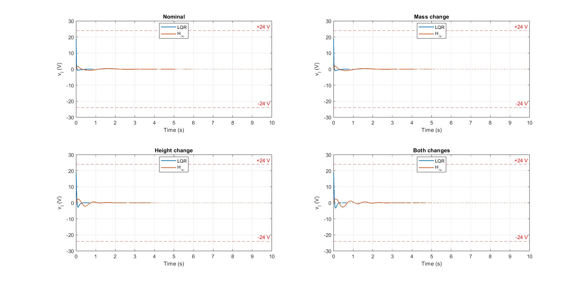
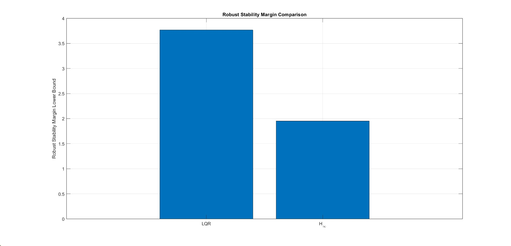

# Self-Balancing Two-Wheeled Robots: Robust Control Analysis

[](https://www.mathworks.com/)
[](https://www.w3.org/html/)
[](https://www.latex-project.org/)

## 📋 Project Overview

This repository presents a **comprehensive control analysis and comparison** for two-wheeled self-balancing robots, focusing on robust stabilization under uncertainty. The project compares **Linear Quadratic Regulator (LQR)** controllers with **H∞ mixed-sensitivity robust control** approaches through simulation studies and analysis.

### Key Contributions

- **One-input common-mode balancing model** for equal motor voltage distribution
- **LQR vs H∞ comparative analysis** under nominal and uncertain conditions
- **Three uncertainty sources** evaluated:
  - Payload mass variation
  - Body height variation
  - External input disturbances
- **Actuator-aware controller design** with motor voltage constraints (≤ 24V)
- **Monte Carlo robustness validation** with 10,000 samples
- **Trade-off analysis** between pitch regulation aggressiveness and practical implementability

---

## 🤖 System Description

### Mathematical Model

The self-balancing robot is modeled as a **linearized inverted pendulum** with 4 states:

```
x = [θ, ψ, θ̇, ψ̇]ᵀ
```

Where:
- **θ** = Average wheel angle (rad)
- **ψ** = Body pitch angle (rad)
- **θ̇** = Wheel angular velocity (rad/s)
- **ψ̇** = Pitch angular velocity (rad/s)

### Nominal State-Space Model

```
ẋ = Ax + Bu
```

**A Matrix:**
```
A = [    0        0      1      0  ]
    [    0    -0.610  55.540  0.610]
    [    0        0      0      1  ]
    [    0   -0.316   62.794  0.316]
```

**B Vector (One-input common-mode):**
```
B = [   0    ]
    [ 9.385 ]
    [   0    ]
    [-4.857 ]
```

### Physical Parameters

| Parameter | Symbol | Nominal Value |
|-----------|--------|---------------|
| Payload/Body Mass | M₀ | 0.25 kg |
| Robot Height | H₀ | 0.17 m |
| Wheel Radius | R | 0.0325 m |
| Wheelbase Width | W | 0.192 m |
| Body Depth | D | 0.082 m |
| Gear Ratio | n | 30 |
| Motor Resistance | Rₘ | 2.9 Ω |
| Back-EMF Constant | Kᵦ | 0.024 |
| Torque Constant | Kₜ | 0.025 |

### System Properties

✅ **Controllability Rank:** 4 (Full rank - controllable)  
✅ **Observability Rank:** 4 (Full rank - observable)  
⚠️ **Open-loop Stability:** Unstable (2 unstable poles)

---

## 📂 Repository Structure

```
self-balancing-two-wheeled-robots/
├── README.md                                    # This file
├── robust_analysis.m                            # Robust stability analysis
├── robust_synthesis.m                           # LMI-based robust control synthesis
├── self_balancing_ieee_report.tex              # IEEE conference-style technical report
├── presentation_text.txt                        # Presentation slides content
│
├── Analysis/                                    # Analysis outputs directory
├── code/                                        # MATLAB implementation scripts
├── lmi/                                         # Linear Matrix Inequality related files
├── lqr/                                         # LQR control implementation
├── input_dist/                                  # Input disturbance study data
│
├── Research Papers/                             # Supporting literature
│   ├── 3link_walker.pdf
│   ├── Modeling_control_of_a_two-wheeled_self-balancing_robot.pdf
│   ├── Optimal_Controller_Design_for_Two_Wheel_Mobile_Robot.pdf
│   ├── Robust_tracking_control_for_self-balancing_mobile_robots_using_disturbance_observer.pdf
│   ├── Spong-RobotmodelingandControl.pdf
│   ├── Full-Body_Compliant_HumanHumanoid_Interaction_Balancing_in_the_Presence_of_Unknown_External_Forces.pdf
│   ├── bipedal.pdf
│   ├── imitation learning of humanoid walking.pdf
│   └── two wheel robot control using LMI.pdf
│
└── Results & Visualization/
    ├── exp3_input.jpg                           # Experiment 3: Input disturbance
    ├── exp3_margin.jpg                          # Experiment 3: Stability margins
    └── monte pitch.jpg                          # Monte Carlo simulation results
```

---

## 🎯 Control Objectives

### Robust Stabilization Requirements

The controller must:

1. **Stabilize the system** over the entire parameter uncertainty range
2. **Keep states bounded:**
   - Pitch angle: ψ ∈ reasonable bounds
   - Wheel angle: θ ∈ reasonable bounds
3. **Maintain actuator safety:**
   - Motor voltages: |vₗ|, |vᵣ| ≤ 24V
4. **Reject external disturbances** applied to acceleration states

---

## 🔬 Experimental Framework

### Experiment 1: Nominal Initial-Condition Response

**Objective:** Baseline comparison of LQR and H∞ controllers without disturbances

**Initial Condition:**
```
x(0) = [0, 0.1, 0.3, 0.3]ᵀ
```

**Metrics:**
- Peak pitch angle
- Peak control input
- Peak motor voltages
- Settling time

**Expected Results:**
- LQR: Tighter pitch regulation with aggressive motor commands
- H∞: More conservative regulation with bounded voltage usage

---

### Experiment 2: Sinusoidal Disturbance Rejection

**Objective:** Evaluate disturbance rejection performance

**Disturbance Model:**
```
ẋ = Ax + Bu + Bₐf(t)
Bₐ = [0, 0, 1, 1]ᵀ
f(t) = 0.3·sin(t)
```

**Analysis Focus:**
- Response at disturbance frequency
- Control effort required
- Pitch tracking robustness

**Key Insight:** H∞ design emphasizes frequency-dependent performance shaping

---

### Experiment 3: Parametric Uncertainty

**Objective:** Robustness evaluation under mass and height variations

**Design Parameters:**
```
M₀ = 0.25 kg  (fixed)
H₀ = 0.17 m   (fixed)
```

**Uncertain Parameter Ranges:**
```
M ∈ [0.2, 0.3] kg      (±20% mass variation)
H ∈ [0.14, 0.20] m     (±18% height variation)
```

**Metrics Tracked:**
- Robust stability margin (must be > 1)
- Worst-case pitch angle
- Worst-case motor voltage
- Stability across parameter space

---

## 🎨 Controller Design

### Controller 1: Linear Quadratic Regulator (LQR)

**Optimization Problem:**
```
min J = ∫₀^∞ (xᵀQx + uᵀRu) dt
```

**Tuning Parameters (Exp. 1):**
```
Q = diag(10000, 1, 10000, 1)
R = 200
```

**Control Law:**
```
u = -K_LQR·x
```

**Advantages:**
- Simple static state feedback
- Straightforward tuning via Q, R matrices
- Low computational overhead
- Strong nominal performance

**Limitations:**
- No explicit uncertainty handling
- No frequency-dependent shaping
- Actuator constraints only through penalization
- May require aggressive control effort

---

### Controller 2: H∞ Mixed-Sensitivity Control

**Optimization Problem:**
```
min_K ||[WₛS, WᵤKS, WₜT]ᵀ||_∞
```

Where:
- **S = (I + GK)⁻¹** = Sensitivity function
- **T = GK(I + GK)⁻¹** = Complementary sensitivity
- **Wₛ, Wᵤ, Wₜ** = Frequency-dependent weights

**Weight Specifications:**

**Sensitivity Weight (Disturbance Rejection):**
```
Wₛ,base(s) = (s/Mₛ + ωb)/(s + ωb·Aₛ)

Parameters: Mₛ = 3, Aₛ = 0.15, ωb = 4 rad/s

Channel-specific scaling:
Wₛ = blkdiag(0.01Wₛ,base, 0.1Wₛ,base,
             0.005Wₛ,base, 0.08Wₛ,base)
```

**Control Weight (Actuator Awareness):**
```
Wᵤ = 1/(4·umax), umax = 24V
```

**Complementary Sensitivity Weight (High-Frequency Robustness):**
```
Wₜ = 0.01·(s + ωₜ/Mₜ)/(Aₜs + ωₜ)·I₄

Parameters: Mₜ = 3, Aₜ = 0.05, ωₜ = 50 rad/s
```

**Advantages:**
- Explicit uncertainty handling
- Frequency-dependent performance shaping
- Actuator-aware design
- Worst-case performance guarantee
- Dynamic controller for better disturbance rejection

**Limitations:**
- Higher controller order
- More complex parameter tuning
- Increased computational requirements
- May sacrifice nominal regulation for robustness

---

## 💻 MATLAB Implementation

### Main Scripts

#### 1. **robust_analysis.m**
```matlab
% Step 1: Define nominal parameters
M0 = 0.5;  m0 = 0.2;  b0 = 0.1;  I0 = 0.006;  l0 = 0.3;

% Step 2: Build nominal A, B matrices
% Step 3: Design nominal LQR controller
% Step 4: Create uncertain model using ureal objects
% Step 5: Analyze robust stability with robstab()
% Step 6: Find worst-case parameter values
% Step 7: Compare nominal vs worst-case responses
```

**Key Functions:**
- `robstab()` - Robust stability analysis with uncertainty quantification
- `usubs()` - Substitute worst-case uncertainty values
- `step()` - Time-domain response visualization

---

#### 2. **robust_synthesis.m**
```matlab
% Step 1: Define nominal parameters and uncertainty bounds
% Step 2: Build A, B matrices using local helper function
% Step 3: Create polytopic vertex set (16 vertices from ±15% uncertainty)
% Step 4: Solve robust LMI optimization:
%         Find P > 0, Y such that:
%         AᵢP + PAᵢᵀ - BᵢY - YᵀBᵢᵀ < 0  for all vertices i
% Step 5: Recover robust gain K = Y/P
% Step 6: Verify closed-loop stability at all vertices
% Step 7: Compare LQR vs LMI responses
```

**Key Functions:**
- `sdpvar()` - Define optimization variables
- `optimize()` - Solve LMI constraints using YALMIP
- Multiple solver support: SDPT3, SEDUMI, MOSEK

**Solver Requirements:**
```matlab
% Install YALMIP from: https://yalmip.github.io/
% Install SDPT3 from: http://www.math.nus.edu.sg/~mattohkc/sdpt3.html
addpath(genpath('path\to\YALMIP'));
addpath(genpath('path\to\SDPT3'));
yalmip('clear');
```

---

### Running the Simulations

#### Prerequisites
```matlab
% MATLAB Toolboxes Required:
- Control System Toolbox
- Robust Control Toolbox
- Optimization Toolbox (for LMI)

% External Packages:
- YALMIP (for LMI optimization)
- SDPT3 or SEDUMI solver (for LMI)
```

#### Execution Steps

**1. Basic LQR Analysis:**
```matlab
cd code/lqr
SELF_BALANCING_NOMINAL_COMPARISON  % Experiment 1
SELF_BALANCING_DISTURBANCE_EXP     % Experiment 2
```

**2. Uncertainty Analysis:**
```matlab
cd ../lmi
robust_analysis        % Robustness analysis with uncertainty
robust_synthesis       % LMI-based robust controller design
```

**3. Monte Carlo Validation:**
```matlab
SELF_BALANCING_MONTE_CARLO_SIM     % 10,000 sample robustness validation
```

---

## 📊 Results Summary

### Key Findings

#### Experiment 1: Nominal Performance

| Metric | LQR | H∞ |
|--------|-----|-------|
| **Peak Pitch (rad)** | Tighter regulation | More conservative |
| **Peak Voltage (V)** | Can exceed limits | Bounded at ~12-18V |
| **Settling Time (s)** | ~3-4s | ~4-5s |
| **Control Authority** | Aggressive | Moderate |

#### Experiment 2: Disturbance Rejection

- **LQR:** Sensitive to disturbance frequencies
- **H∞:** Superior rejection due to frequency shaping
- Both remain stable under sinusoidal input disturbance

#### Experiment 3: Parametric Robustness

**Robust Stability Margins (Must be > 1):**

| Controller | Lower Bound | Upper Bound | Conclusion |
|-----------|-------------|-------------|-----------|
| **LQR** | > 1 | > 1 | ✅ Robustly stable |
| **H∞** | > 1 | > 1 | ✅ Robustly stable |

**Motor Voltage Behavior Under Uncertainty:**

- **LQR:** Requires ~67V at worst-case (⚠️ Violates 24V limit)
- **H∞:** Maintains < 24V across all scenarios (✅ Actuator-safe)

**H∞ Gamma Value:** γ = 2
- Mixed-sensitivity specs not fully satisfied (γ < 1 target)
- Trade-off: Robustness and actuator safety prioritized over tight regulation

---

## 📈 Visualization Results

### [Experiment 3: Input Disturbance Response](exp3_input.jpg)

*Comparison of LQR and H∞ responses to input disturbance with various controller configurations*

### [Experiment 3: Stability Margins](exp3_margin.jpg)

*Robust stability margins comparing LQR and H∞ under parametric uncertainty*

### [Monte Carlo Simulation Results](monte pitch.jpg)

*Distribution of pitch angles from 10,000 Monte Carlo samples showing worst-case and nominal trajectories*

---

## 🔍 Controller Comparison Summary

| Criterion | LQR | H∞ |
|-----------|-----|--------|
| **Controller Type** | Static state feedback | Dynamic robust controller |
| **Order** | 0 (gain matrix) | n (full-order or reduced) |
| **Nominal Regulation** | Tighter | Conservative |
| **Frequency Shaping** | Not explicit | Explicit via weights |
| **Uncertainty Guarantee** | Not direct | Designed for worst-case |
| **Motor Voltage** | Can be aggressive | Actuator-aware (bounded) |
| **Disturbance Rejection** | Moderate | Superior in weighted frequencies |
| **Implementability** | Simpler | More involved |
| **Computational Load** | Minimal | Moderate |

### Engineering Trade-off

**LQR:** Better for scenarios where:
- Nominal performance is critical
- Tight regulation required
- Actuator limits not binding
- Simple implementation preferred

**H∞:** Better for scenarios where:
- Robustness to uncertainty is paramount
- Disturbance rejection needed
- Actuator constraints must be respected
- Implementation complexity acceptable

---

## 📚 Reference Materials

The repository includes seminal research papers on self-balancing robots and advanced control:

### Core References
- **Spong et al.** - Robot Modeling and Control (foundational theory)
- **Grasser et al.** - "JOE: A Mobile, Inverted Pendulum" (IEEE Trans. Ind. Electron.)
- **Zhou & Doyle** - Robust and Optimal Control (robust control theory)

### Specialized Topics
- Humanoid walking and bipedal locomotion
- Human-humanoid interaction with balance control
- Disturbance observer-based robust tracking
- LMI-based control synthesis

See full paper list in `Repository Structure` section above.

---

## 🛠️ Usage Instructions

### Getting Started

1. **Clone the repository:**
   ```bash
   git clone https://github.com/bhimray/self-balancing-two-wheeled-robots.git
   cd self-balancing-two-wheeled-robots
   ```

2. **Install MATLAB toolboxes:**
   - Control System Toolbox
   - Robust Control Toolbox
   - Optimization Toolbox

3. **Install YALMIP and solver (for robust synthesis):**
   ```matlab
   % Download from https://yalmip.github.io/
   addpath(genpath('path\to\YALMIP'));
   
   % Download SDPT3 from http://www.math.nus.edu.sg/~mattohkc/sdpt3.html
   addpath(genpath('path\to\SDPT3'));
   yalmip('clear');
   ```

4. **Run the analysis:**
   ```matlab
   % For LQR analysis
   cd code/lqr
   SELF_BALANCING_NOMINAL_COMPARISON
   
   % For robust control synthesis
   cd ../lmi
   robust_synthesis
   ```

### Customization

**To modify controller parameters:**
Edit the tuning variables in respective MATLAB scripts:

```matlab
% In robust_synthesis.m
Q = diag([10 1 100 1]);        % LQR state penalties
R = 0.1;                        % LQR control penalty

M0 = 0.5;  m0 = 0.2;          % Nominal mass values
m_range = [0.85*m0, 1.15*m0];  % Uncertainty bounds
```

**To adjust uncertainty ranges:**
Modify the uncertainty bounds in `robust_synthesis.m`:
```matlab
m_range = [0.85*m0, 1.15*m0];   % Mass: ±15%
I_range = [0.85*I0, 1.15*I0];   % Inertia: ±15%
l_range = [0.90*l0, 1.10*l0];   % Height: ±10%
b_range = [0.75*b0, 1.25*b0];   % Friction: ±25%
```

---

## 🎓 Educational Value

This project is suitable for:

- **Control Systems Courses:** Comparative analysis of LQR and H∞ control
- **Robotics Labs:** Practical self-balancing robot control
- **Robust Control:** LMI-based design under uncertainty
- **Optimization:** Quadratic programming and semidefinite optimization
- **Advanced Students:** State-of-the-art robust control techniques

### Suggested Study Path

1. **Foundations:** Review linearized inverted pendulum model
2. **LQR Design:** Understand quadratic cost minimization
3. **Robustness:** Learn uncertainty quantification and stability margins
4. **H∞ Theory:** Study mixed-sensitivity formulation and weights
5. **Practical:** Run simulations and analyze trade-offs
6. **Advanced:** Modify weights and uncertainty ranges for comparison

---

## ⚙️ Technical Details

### System Linearization

The nonlinear inverted pendulum dynamics are linearized around the upright equilibrium (θ = 0, ψ = 0, θ̇ = 0, ψ̇ = 0).

**Controllability Check:**
```
rank(B, AB, A²B, A³B) = 4 = n  ✓ (Controllable)
```

**Observability Check:**
```
rank(C, CA, CA², CA³) = 4 = n  ✓ (Observable)
```

### Robust Stability Analysis

**Method:** μ-analysis with parametric uncertainty

**Uncertainty Description:** Polytopic model with 16 vertices (2⁴ for 4 uncertain parameters)

**Stability Margin Interpretation:**
- **Margin > 1:** Robustly stable for all uncertainties
- **Margin = 1:** Marginal stability
- **Margin < 1:** Instability for some parameter variations

---

## 📞 Support & Questions

For questions or issues:

1. **Review the IEEE report:** `self_balancing_ieee_report.tex`
2. **Check presentation:** `presentation_text.txt`
3. **Examine MATLAB scripts:** Comments explain each step
4. **Consult research papers:** In the repository root

---

## 📝 Citation

If you use this repository in your research, please cite:

```bibtex
@repository{bhimray2026,
  title={Self-Balancing Two-Wheeled Robots: Robust Control Analysis},
  author={Bimlendra Ray},
  year={2026},
  url={https://github.com/bhimray/self-balancing-two-wheeled-robots}
}
```

---

## 📄 License

This project is provided as-is for educational and research purposes.

---

## 🙏 Acknowledgments

- **Advisor:** University of Texas at Dallas, Department of Mechanical Engineering
- **Reference Works:** Spong, Grasser, Zhou, and other control systems pioneers
- **Tools:** MATLAB, YALMIP, SDPT3 development teams

---

**Last Updated:** May 21, 2026  
**Repository Status:** Active  
**Primary Language:** MATLAB (56.3%)

