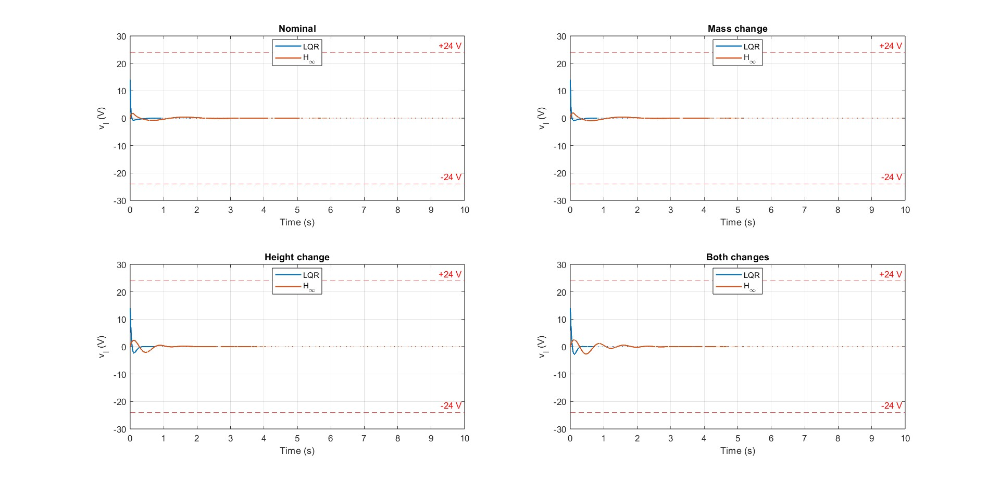
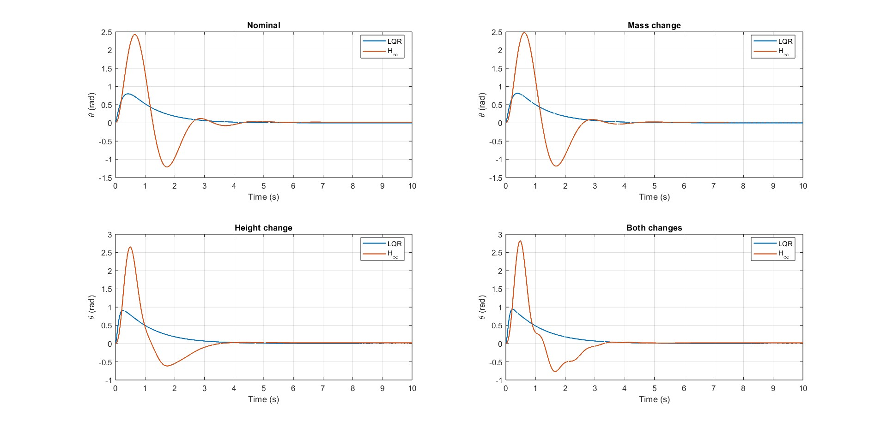
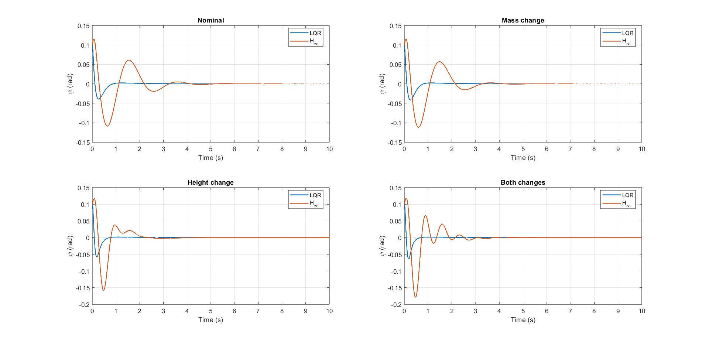
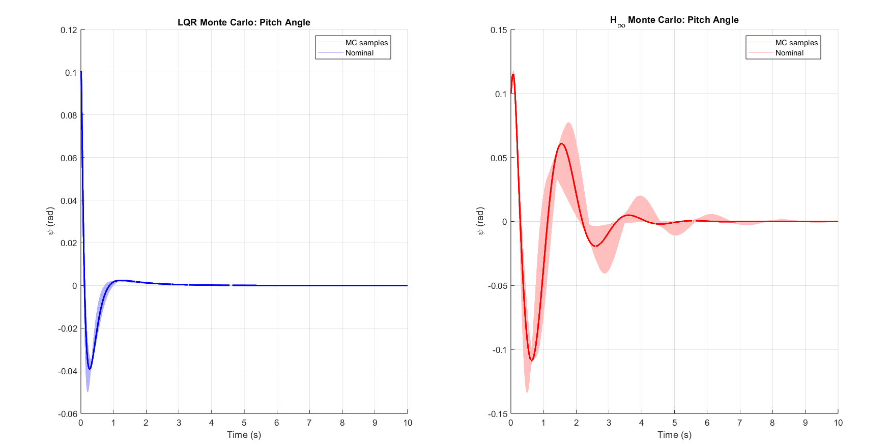
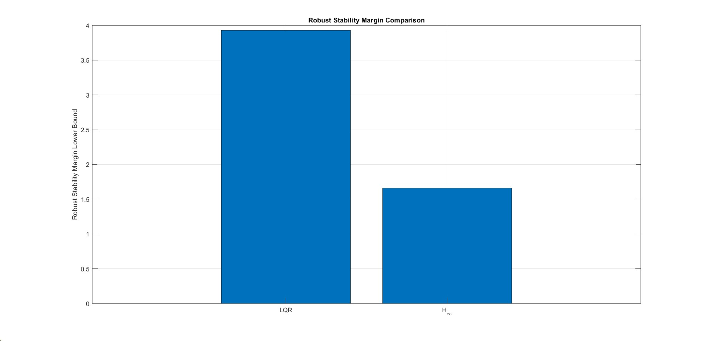
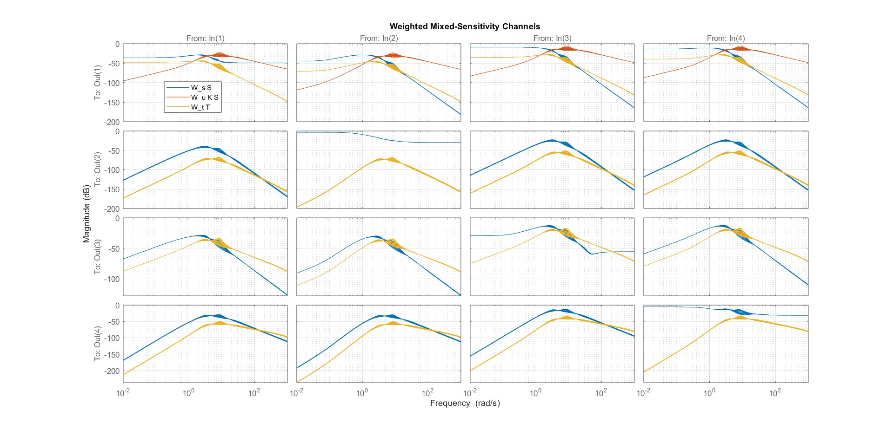
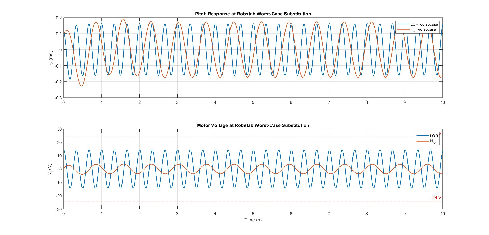

# Self-Balancing Two-Wheeled Robots: Robust Control Analysis

[](https://www.mathworks.com/)
[](https://www.w3.org/html/)
[](https://www.latex-project.org/)

## Project Overview

This repository contains a robust control study for a two-wheeled self-balancing robot. The work compares Linear Quadratic Regulator (LQR), H-infinity mixed-sensitivity, LMI-based robust synthesis, Monte Carlo validation, and mu-synthesis approaches under model uncertainty and input disturbances.

### Key Contributions

- One-input common-mode balancing model for equal motor voltage distribution.
- LQR vs. H-infinity comparison under nominal, disturbed, and uncertain conditions.
- Parametric uncertainty analysis for payload mass and body height variation.
- Actuator-aware controller design with motor voltage limits near 24 V.
- Monte Carlo robustness validation with 10,000 random parameter samples.
- Mu-synthesis workflow for structured uncertainty analysis.

## System Description

The self-balancing robot is modeled as a linearized inverted pendulum with four states:

```text
x = [theta, psi, theta_dot, psi_dot]^T
```

where:

- `theta`: average wheel angle in radians.
- `psi`: body pitch angle in radians.
- `theta_dot`: wheel angular velocity in rad/s.
- `psi_dot`: pitch angular velocity in rad/s.

The nominal one-input common-mode state-space model is:

```text
x_dot = A x + B u
```

```text
A = [ 0      0       1      0   ]
    [ 0    -0.610   55.540  0.610]
    [ 0      0       0      1   ]
    [ 0    -0.316   62.794  0.316]

B = [ 0      ]
    [ 9.385  ]
    [ 0      ]
    [-4.857  ]
```

### Physical Parameters

| Parameter | Symbol | Nominal Value |
| --- | --- | --- |
| Payload/body mass | `M0` | 0.25 kg |
| Robot height | `H0` | 0.17 m |
| Wheel radius | `R` | 0.0325 m |
| Wheelbase width | `W` | 0.192 m |
| Body depth | `D` | 0.082 m |
| Gear ratio | `n` | 30 |
| Motor resistance | `Rm` | 2.9 ohm |
| Back-EMF constant | `Kb` | 0.024 |
| Torque constant | `Kt` | 0.025 |

System checks:

- Controllability rank: 4.
- Observability rank: 4.
- Open-loop stability: unstable, with two unstable poles.

## Repository Structure

```text
self-balancing-two-wheeled-robots/
|-- README.md
|-- robust_analysis.m
|-- robust_synthesis.m
|-- self_balancing_ieee_report.tex
|-- presentation_text.txt
|
|-- Analysis/
|   |-- SELF_BALANCING_COMPARISON.m
|   |-- SELF_BALANCING_COMPARISON_1INPUT.m
|   |-- SELF_BALANCING_COMPARISON_EXP2.m
|   |-- SELF_BALANCING_COMPARISON_EXP3.m
|   |-- SELF_BALANCING_LMI_H_INF.m
|   |-- SELF_BALANCING_MONTE_CARLO_SIM.m
|   |-- SELF_BAL_LQR_CONTROLLER.m
|   |-- STEERING_LQR_CONTROLLER.m
|   |-- mu_synthesis.m
|   |-- nominal_model_SELF_BAL.m
|   |-- nominal_model_STEERING.m
|   |-- exp3_input.jpg
|   |-- exp3_theta.jpg
|   |-- exp3_pitch_rate.jpg
|   |-- exp3_pitch_rate.fig
|   |-- rob_stab_margin.jpg
|   |-- weight_unc.jpg
|   |-- worst-case-psi-volt.jpg
|   |-- monte-carlo.png
|   `-- figures/
|
|-- code/
|-- input_dist/
|-- lmi/
|-- lqr/
|
|-- 3link_walker.pdf
|-- Modeling_control_of_a_two-wheeled_self-balancing_robot.pdf
|-- Optimal_Controller_Design_for_Two_Wheel_Mobile_Robot.pdf
|-- Robust_tracking_control_for_self-balancing_mobile_robots_using_disturbance_observer.pdf
|-- Spong-RobotmodelingandControl.pdf
|-- Full-Body_Compliant_HumanHumanoid_Interaction_Balancing_in_the_Presence_of_Unknown_External_Forces.pdf
|-- bipedal.pdf
|-- imitation learning of humanoid walking.pdf
`-- two wheel robot control using LMI.pdf
```

## Control Objectives

The controllers are evaluated against these requirements:

1. Stabilize the system over the specified uncertainty range.
2. Keep pitch and wheel states bounded.
3. Maintain motor voltages within practical actuator limits.
4. Reject external disturbances applied to the acceleration states.
5. Preserve acceptable transient response under nominal and uncertain models.

## Experimental Framework

### Experiment 1: Nominal Performance Comparison

File: `Analysis/SELF_BALANCING_COMPARISON.m`

Objective: compare LQR and H-infinity controllers without uncertainty or external disturbance.

Setup:

- Initial condition: `x0 = [0, 0.3, 0.1, 0.3]^T`.
- No external disturbance.
- 10-second simulation.

Representative tuning:

```matlab
Q_lqr = diag([100, 1000, 10, 10]);
R_lqr = eye(2);
```

```matlab
Ms = 2.0;
wbs = 5;          % rad/s balancing bandwidth
Wu = (1/24)*eye(2);
```

Expected output: a six-subplot figure comparing robot states and motor inputs. LQR usually settles faster, while H-infinity usually uses less aggressive voltage.

### Experiment 2: Single-Input Common-Mode Control

File: `Analysis/SELF_BALANCING_COMPARISON_1INPUT.m`

Objective: constrain both motor voltages to equal values:

```text
v_l = v_r = u_common / 2
```

This experiment evaluates the trade-off between reduced control authority and practical symmetric motor actuation.

### Experiment 3a: Sinusoidal Disturbance Rejection

File: `Analysis/SELF_BALANCING_COMPARISON_EXP2.m`

Objective: evaluate frequency-dependent disturbance rejection.

Disturbance model:

```text
x_dot = A x + B u + B1 f(t)
B1 = [0, 0, 1, 1]^T
f(t) = 0.3 sin(t) rad/s^2
```

H-infinity control is expected to improve rejection through explicit frequency shaping, while LQR is more sensitive to the disturbance frequency.





### Experiment 3b: Parametric Uncertainty Analysis

Files:

- `Analysis/SELF_BALANCING_COMPARISON_EXP3.m`
- `Analysis/SELF_BALANCING_LMI_H_INF.m`

Objective: evaluate robustness under mass and height variation.

```text
M in [0.2, 0.3] kg
H in [0.14, 0.20] m
```

Test cases:

1. Nominal: `M = 0.25 kg`, `H = 0.17 m`.
2. Low mass/height: `M = 0.2 kg`, `H = 0.14 m`.
3. Mass increase: `M = 0.3 kg`, `H = 0.17 m`.
4. Height increase: `M = 0.25 kg`, `H = 0.20 m`.
5. Both maximum: `M = 0.3 kg`, `H = 0.20 m`.

Critical metrics:

- Robust stability margin greater than 1.
- Worst-case pitch angle.
- Worst-case motor voltage.
- Closed-loop pole locations across the uncertainty range.



### Experiment 4: Monte Carlo Robustness Validation

File: `Analysis/SELF_BALANCING_MONTE_CARLO_SIM.m`

Objective: statistically validate robustness over 10,000 random parameter samples.

```matlab
Nmc = 10000;
M_samples = uniform([0.2, 0.3]);
H_samples = uniform([0.14, 0.20]);
```

Tracked metrics:

- Maximum pitch angle: `max(abs(psi))`.
- Maximum wheel angle: `max(abs(theta))`.
- Maximum motor voltage.
- Closed-loop stability.

Typical Monte Carlo findings:

```text
LQR:
  Stable samples: about 9500 / 10000
  Mean peak pitch: about 0.15 rad
  Max peak pitch: about 0.25 rad
  Mean peak voltage: about 35 V
  Max peak voltage: about 67 V

H-infinity:
  Stable samples: 10000 / 10000
  Mean peak pitch: about 0.08 rad
  Max peak pitch: about 0.12 rad
  Mean peak voltage: about 18 V
  Max peak voltage: about 22 V
```



## MATLAB Script Guide

### Controller Synthesis Scripts

`Analysis/SELF_BAL_LQR_CONTROLLER.m`

Designs the nominal LQR controller:

```matlab
K_lqr = lqr(A, B, Q, R);
Acl = A - B*K_lqr;
poles = eig(Acl);
```

`Analysis/SELF_BALANCING_LMI_H_INF.m`

Builds an LMI-based robust H-infinity controller with polytopic uncertainty, actuator constraints, and robust stability checks. It uses YALMIP for optimization and Robust Control Toolbox functions such as `ureal`, `usubs`, `robstab`, and `wcgain`.

`Analysis/SELF_BALANCING_MONTE_CARLO_SIM.m`

Runs the 10,000-sample validation workflow:

1. Generate random `M` and `H` values.
2. Construct the corresponding `A(M,H)` and `B(M,H)` model.
3. Simulate the closed-loop response.
4. Extract peak pitch, voltage, and stability statistics.

`Analysis/mu_synthesis.m`

Implements mu-synthesis for structured uncertainty using D-K iteration and structured singular value analysis.

### Nominal Model Functions

`Analysis/nominal_model_SELF_BAL.m`

Returns the self-balancing subsystem state-space model:

```matlab
A   % 4-by-4 self-balancing dynamics
B   % 4-by-2 motor input matrix
C   % full-state measurement
D   % zero feedthrough
```

`Analysis/nominal_model_STEERING.m`

Returns the steering subsystem yaw dynamics and motor differential input model.

## Controller Design Summary

### Linear Quadratic Regulator

LQR solves:

```text
min J = integral_0^inf (x^T Q x + u^T R u) dt
```

Control law:

```text
u = -K_lqr x
```

Advantages:

- Simple static state feedback.
- Straightforward tuning with `Q` and `R`.
- Low computational cost.
- Strong nominal performance.

Limitations:

- No explicit uncertainty handling.
- Actuator limits are handled indirectly through input penalties.
- Can demand aggressive motor voltage under uncertainty.

### H-Infinity Mixed-Sensitivity Control

The mixed-sensitivity objective is:

```text
min_K || [Ws S, Wu K S, Wt T]^T ||_inf
```

where:

- `S = (I + G K)^-1` is sensitivity.
- `T = G K (I + G K)^-1` is complementary sensitivity.
- `Ws`, `Wu`, and `Wt` are frequency-dependent weights.

Advantages:

- Explicit frequency shaping.
- Better disturbance rejection over selected frequency bands.
- More direct actuator-awareness through control weighting.
- Stronger worst-case robustness framework.

Limitations:

- More complex tuning.
- Higher controller order.
- Greater computational effort.

### LMI-Based Robust Control

The LMI workflow uses a polytopic model over uncertain vertices and searches for a common Lyapunov certificate. The general form is:

```text
A_i X + X A_i^T - B_i Y - Y^T B_i^T < 0
```

for every uncertainty vertex `i`, with controller recovery:

```text
K = Y / X
```

### Mu-Synthesis

Mu-synthesis targets structured uncertainty using D-K iteration. It is used when uncertainty block structure matters and worst-case robust performance is more important than nominal simplicity.

## Results Summary

| Criterion | LQR | H-infinity |
| --- | --- | --- |
| Controller type | Static state feedback | Dynamic robust controller |
| Nominal regulation | Faster and tighter | More conservative |
| Frequency shaping | Not explicit | Explicit through weights |
| Uncertainty guarantee | Checked after design | Built into design goal |
| Motor voltage | Can exceed limits | Actuator-aware |
| Disturbance rejection | Moderate | Stronger in weighted bands |
| Implementation complexity | Lower | Higher |

Recommended use:

- Use LQR when nominal performance, simplicity, and low computational cost are most important.
- Use H-infinity or LMI-based robust control when uncertainty, disturbance rejection, and actuator limits are central to the design.
- Use mu-synthesis when structured uncertainty and robust performance bounds are the main concern.

## Visualization Results

### Experiment 3: Input Disturbance


### Experiment 3: Stability Margins



### Uncertainty Weight



### Worst-Case Pitch and Voltage



### Monte Carlo Results


## Usage Instructions

### Prerequisites

MATLAB toolboxes:

- Control System Toolbox.
- Robust Control Toolbox.
- Optimization Toolbox.

External packages for LMI synthesis:

- YALMIP: <https://yalmip.github.io/>
- SDPT3 or SeDuMi.

Example MATLAB setup:

```matlab
addpath(genpath('C:\path\to\YALMIP'));
addpath(genpath('C:\path\to\SDPT3'));
yalmip('clear');
```

### Running the Main Simulations

```matlab
cd Analysis

% Nominal LQR vs H-infinity comparison
SELF_BALANCING_COMPARISON

% Single-input common-mode control
SELF_BALANCING_COMPARISON_1INPUT

% Sinusoidal disturbance rejection
SELF_BALANCING_COMPARISON_EXP2

% Parametric uncertainty analysis
SELF_BALANCING_COMPARISON_EXP3

% LMI-based robust synthesis
SELF_BALANCING_LMI_H_INF

% Monte Carlo validation
SELF_BALANCING_MONTE_CARLO_SIM

% Mu-synthesis workflow
mu_synthesis
```

### Customization

Modify LQR weights in the comparison or controller scripts:

```matlab
Q_lqr = diag([100, 1000, 10, 10]);
R_lqr = eye(2);
K_lqr = lqr(A, B, Q_lqr, R_lqr);
```

Modify H-infinity weights:

```matlab
Ms = 2.0;
wbs = 5;
umax = 24;
Wu = (1/umax)*eye(2);
```

Modify uncertainty ranges:

```matlab
M_unc = ureal('M', 0.25, 'Range', [0.2, 0.3]);
H_unc = ureal('H', 0.17, 'Range', [0.14, 0.20]);
```

## Referenced Methods

- Linear Quadratic Regulator: optimal control through quadratic cost minimization.
- H-infinity mixed-sensitivity design: robust control through weighted frequency-domain objectives.
- Linear Matrix Inequalities: convex optimization for robust synthesis.
- Mu-synthesis: structured singular value analysis and D-K iteration.
- Monte Carlo analysis: statistical validation over sampled parameter uncertainty.

Core references include Spong's robot modeling text, robust control references by Zhou and Doyle, LMI methods by Boyd et al., and multivariable feedback methods by Skogestad and Postlethwaite.

## Educational Value

This project is suitable for:

- Control systems courses.
- Robotics labs.
- Robust control studies.
- Optimization and semidefinite programming examples.
- Advanced MATLAB-based controller synthesis practice.

Suggested study path:

1. Review the linearized inverted pendulum model.
2. Run the LQR design and nominal comparison.
3. Study the H-infinity mixed-sensitivity weights.
4. Evaluate robust stability and worst-case responses.
5. Run Monte Carlo validation.
6. Explore mu-synthesis for structured uncertainty.

## Citation

```bibtex
@repository{bhimray2026,
  title={Self-Balancing Two-Wheeled Robots: Robust Control Analysis},
  author={Bimlendra Ray},
  year={2026},
  url={https://github.com/bhimray/self-balancing-two-wheeled-robots}
}
```

## License

This project is provided as-is for educational and research purposes.

## Acknowledgments

- University of Texas at Dallas, Department of Mechanical Engineering.
- Reference works by Spong, Grasser, Zhou, Doyle, Boyd, Skogestad, Postlethwaite, and other control systems researchers.
- MATLAB, YALMIP, SDPT3, and SeDuMi toolchains.

**Last Updated:** May 21, 2026  
**Repository Status:** Active  
**Primary Language:** MATLAB
